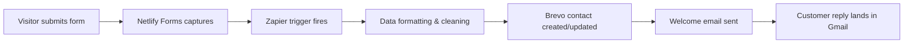

# Beauty Quest – Full Stack Technical Handoff

**Complete technical documentation for the Beauty Quest website and conversion funnel system**

Domain: `bqhotsprings.com` | Stack: Netlify + Brevo + Zapier + ImprovMX

---

## Table of Contents

1. [Domain & DNS Setup](#1-domain--dns-setup)
2. [Website (Netlify)](#2-website-netlify)
3. [Netlify Forms (Ingest)](#3-netlify-forms-ingest)
4. [Email Sending (Brevo)](#4-email-sending-brevo)
5. [Automation (Zapier)](#5-automation-zapier)
6. [End-to-End Data Flow](#6-end-to-end-data-flow)
7. [Testing Runbook](#7-testing-runbook)
8. [Troubleshooting Guide](#8-troubleshooting-guide)
9. [Codebase Notes](#9-codebase-notes)
10. [Handoff Checklist](#10-handoff-checklist)
11. [Future Improvements](#11-future-improvements)

---

## 1. Domain & DNS Setup

**Objective:** Host site on Netlify, forward email via ImprovMX, and authorize Brevo for domain sending.

### DNS Configuration (Netlify DNS)

**Registrar/Host:** Netlify DNS

#### Site Records
```
bqhotsprings.com → Netlify (synthetic record)
www.bqhotsprings.com → Netlify (synthetic record)
```

#### Email Forwarding (ImprovMX)
```
MX Records:
- mx1.improvmx.com (priority 10)
- mx2.improvmx.com (priority 20)

Email Aliases:
- book@bqhotsprings.com → hairbybrendalee@gmail.com
- booking@bqhotsprings.com → hairbybrendalee@gmail.com
```

#### Security & Authentication Records
```
SPF: "v=spf1 include:spf.brevo.com ~all"
DMARC: "v=DMARC1; p=none; rua=mailto:postmaster@bqhotsprings.com"
```

#### Brevo Domain Authentication
```
DKIM CNAMEs (provided by Brevo):
- brevo1._domainkey.bqhotsprings.com
- brevo2._domainkey.bqhotsprings.com
```

### Verification Commands
```bash
# Check MX records
nslookup -type=mx bqhotsprings.com 1.1.1.1

# Verify DNS propagation
dig bqhotsprings.com MX
```

**Note:** DNS propagation can take minutes to hours. Re-check Brevo "Senders, domains, IPs" for DKIM authentication status.

---

## 2. Website (Netlify)

**Project:** Netlify-hosted single-page site for `bqhotsprings.com`

### Stack Details
- **Framework:** Clean HTML with Tailwind CSS
- **Hosting:** Netlify with auto-deploy from GitHub
- **Repository:** `Hair-By-Brenda-Lee`

### Key Features
- Responsive hair salon website
- Hero promo card with 20% off conversion funnel
- Clean contact form integration
- Professional gallery and services sections

### Form Implementation

#### HTML Structure
```html
<form name="brenda_leads" method="POST" data-netlify="true" action="/thanks">
  <input type="hidden" name="form-name" value="brenda_leads">
  <!-- Form fields -->
</form>
```

#### Form Fields
- **Name:** `name` (required)
- **Email:** `email` (required) 
- **Phone:** `phone` (optional)
- **Consent Email:** `consent_email` (required checkbox)
- **Consent SMS:** `consent_sms` (optional checkbox)

#### JavaScript Normalization
```javascript
// Phone number normalization to E.164 format
function toE164(v) {
  if (!v) return "";
  v = (v + "").replace(/\D+/g, "");
  if (v.startsWith("1") && v.length === 11) return "+" + v;
  if (v.length === 10) return "+1" + v;
  return v;
}

// Boolean field normalization for reliable Zapier processing
function setBooleanField(form, name, checked) {
  // Ensures checkboxes always send true/false values
}
```

---

## 3. Netlify Forms (Ingest)

**Purpose:** Capture form submissions and trigger automation pipeline

### Configuration
- **Form Detection:** Enabled in Netlify dashboard
- **Form Name:** `brenda_leads`
- **Honeypot:** Built-in spam protection

### Data Flow
```
Visitor submits form → Netlify captures → Stored in Netlify Forms → Zapier trigger fires
```

### Netlify Dashboard Access
1. Navigate to Netlify site dashboard
2. Go to "Forms" section
3. View submissions under `brenda_leads` form

---

## 4. Email Sending (Brevo)

**Purpose:** Send welcome emails and manage contact database

### Sender Configuration
```
From Name: Brenda
From Email: book@bqhotsprings.com (verified in Brevo)
Reply-To: hairbybrendalee@gmail.com
```

### Welcome Email Template
```
Subject: Welcome to Beauty Quest — 20% off your first visit
Content: Professional welcome email with:
- 20% off promotion details
- "Book Online" CTA button  
- "Call/Text" contact option
- Social media links (Instagram, Yelp)
- Unsubscribe footer
```

### Domain Authentication
- **Status:** Must show as authenticated in Brevo dashboard
- **DKIM:** Two DKIM records configured in DNS
- **SPF:** Includes Brevo sending servers

**Note:** Initial emails may land in Gmail Promotions tab. Engagement improves inbox delivery over time.

---

## 5. Automation (Zapier)

**Zap Name:** Beauty Quest v2 (Active)

### Automation Steps

#### 1. Trigger - Netlify Forms
```
Service: Netlify
Event: New Form Submission
Site: bqhotsprings.com Netlify project
Form: brenda_leads
```

#### 2. Formatter - Email Cleanup
```
Service: Formatter by Zapier (Utilities)
Action: Lowercase and trim email address
Optional: Split name into first/last components
```

#### 3. Formatter - Phone Normalization
```
Service: Formatter by Zapier (Numbers)
Action: Convert phone to E.164 format (+1XXXXXXXXXX)
Purpose: Standardize phone numbers for CRM
```

#### 4. Formatter - Boolean Mapping
```
Service: Formatter by Zapier (Utilities)  
Action: Map checkbox values to true/false
Fields: consent_email, consent_sms
```

#### 5. Brevo - Contact Management
```
Service: Brevo
Action: Add/Update Contact
Target List: Brenda VIP list
Upsert: Enabled (update if exists, create if new)

Mapped Fields:
- Email: cleaned email address
- First Name: extracted from name field
- Phone: normalized E.164 format
- Consent Email: true/false
- Consent SMS: true/false
```

#### 6. Brevo - Send Welcome Email
```
Service: Brevo
Action: Send Transactional Email
Template: Welcome to Beauty Quest template

Configuration:
- To: cleaned email address
- From: book@bqhotsprings.com (Name: Brenda)
- Reply-To: hairbybrendalee@gmail.com
- Subject: Welcome to Beauty Quest — 20% off your first visit
- Content: HTML template from Brevo
```

---

## 6. End-to-End Data Flow



**Complete Pipeline:**
1. User fills out form on `bqhotsprings.com`
2. Netlify captures and stores submission
3. Zapier receives webhook notification
4. Data gets cleaned and normalized
5. Contact added/updated in Brevo CRM
6. Welcome email sent via Brevo
7. Customer replies go to `hairbybrendalee@gmail.com`

---

## 7. Testing Runbook

### Complete End-to-End Test

#### Step 1: Form Submission
1. Navigate to `https://bqhotsprings.com`
2. Scroll to "Join the VIP List" section
3. Fill out form with test data:
   ```
   Name: Test User
   Email: your-test-email@gmail.com
   Phone: (555) 123-4567
   ✅ Email consent (required)
   ☐ SMS consent (optional)
   ```
4. Click "Join & Request Booking"

#### Step 2: Netlify Verification
1. Login to Netlify dashboard
2. Navigate to site → Forms
3. Verify `brenda_leads` shows new submission
4. Confirm data captured correctly

#### Step 3: Zapier Verification
1. Login to Zapier dashboard
2. Go to "Zap Runs" for Beauty Quest v2
3. Verify latest run shows as successful (green)
4. Check each step for proper data transformation

#### Step 4: Brevo Verification
1. Login to Brevo dashboard
2. Navigate to Contacts → Brenda VIP list
3. Verify new contact appears with correct:
   - Email address
   - Name
   - Phone number (E.164 format)
   - Consent preferences

#### Step 5: Email Delivery
1. Check test email inbox
2. Look for welcome email from Brenda
3. Verify subject: "Welcome to Beauty Quest — 20% off your first visit"
4. Check email formatting and links
5. If not in inbox, check Promotions/Spam folders

#### Step 6: Reply Test
1. Reply to welcome email
2. Verify reply appears in `hairbybrendalee@gmail.com`
3. Confirm Reply-To header working correctly

---

## 8. Troubleshooting Guide

### Form Not Triggering Zapier

**Symptoms:** Form submits but Zapier doesn't run

**Solutions:**
1. **Check Form Attributes:**
   ```html
   <form name="brenda_leads" method="POST" data-netlify="true">
     <input type="hidden" name="form-name" value="brenda_leads">
   ```

2. **Verify Netlify Form Detection:**
   - Ensure "Form detection" enabled in Netlify dashboard
   - Check that form appears in Netlify Forms section

3. **Redeploy Site:**
   ```bash
   git push origin main  # Triggers automatic redeploy
   ```

4. **Check Zapier Configuration:**
   - Verify trigger points to correct Netlify site
   - Confirm form name matches exactly: `brenda_leads`

### No Welcome Email Delivered

**Symptoms:** Contact created but no email received

**Solutions:**
1. **Check Zapier Run Details:**
   - Look for errors in Brevo send step
   - Verify email formatting in formatter steps

2. **Verify Brevo Domain Authentication:**
   - Check "Senders, domains, IPs" in Brevo
   - Ensure domain shows as authenticated
   - Verify DKIM records in DNS

3. **Check Email Destination:**
   - Look in Promotions tab (Gmail)
   - Check Spam/Junk folders
   - Verify email address spelling

4. **Test Brevo Sending:**
   - Send test email from Brevo dashboard
   - Verify sender `book@bqhotsprings.com` is validated

### Customer Replies Not Received

**Symptoms:** Customer replies don't reach Gmail

**Solutions:**
1. **Verify Reply-To Header:**
   - Check Zapier Brevo step configuration
   - Ensure Reply-To: `hairbybrendalee@gmail.com`

2. **Check MX Records:**
   ```bash
   nslookup -type=mx bqhotsprings.com
   ```
   Should return ImprovMX servers

3. **Verify ImprovMX Aliases:**
   - Login to ImprovMX dashboard
   - Confirm `book@bqhotsprings.com` → `hairbybrendalee@gmail.com`

### DNS/Email Forwarding Issues

**Symptoms:** Email bounces or delivery failures

**Solutions:**
1. **Check DNS Propagation:**
   ```bash
   dig bqhotsprings.com MX
   nslookup -type=txt bqhotsprings.com  # Check SPF/DMARC
   ```

2. **Verify ImprovMX Status:**
   - Check ImprovMX dashboard for issues
   - Test email forwarding manually

3. **Review DNS Records:**
   - Ensure MX records point to ImprovMX servers
   - Verify SPF includes Brevo: `include:spf.brevo.com`

---

## 9. Codebase Notes

### Key Files

#### `index.html`
- **Location:** Root directory
- **Purpose:** Main website with integrated Netlify form
- **Key Components:**
  - Hero promo card (20% off conversion funnel)
  - Form with `brenda_leads` name and proper Netlify attributes
  - JavaScript for phone/boolean normalization

#### `thanks.html` 
- **Location:** Root directory  
- **Purpose:** Thank you page after form submission
- **Features:** Professional confirmation with 20% off details

#### `wire_hair_images.py`
- **Location:** `scripts/` directory
- **Purpose:** One-time utility script
- **Function:** Replaced Unsplash placeholders with real hair salon images

### Form Implementation Details

```html
<!-- Critical Netlify Form Attributes -->
<form name="brenda_leads" method="POST" data-netlify="true" action="/thanks">
  <input type="hidden" name="form-name" value="brenda_leads">
  
  <!-- Honeypot for spam protection -->
  <p class="hidden">
    <label>Don't fill this out: <input name="bot-field"></label>
  </p>
  
  <!-- Form fields with proper names for Zapier mapping -->
  <input type="text" name="name" required>
  <input type="email" name="email" required>
  <input type="tel" name="phone">
  <input type="checkbox" name="consent_email" value="true" required>
  <input type="checkbox" name="consent_sms" value="true">
</form>
```

### JavaScript Normalization
```javascript
// Complete JavaScript implementation for form processing
(function() {
  function toE164(v) {
    if (!v) return "";
    v = (v + "").replace(/\D+/g, "");          // strip non-digits
    if (v.startsWith("1") && v.length === 11) return "+" + v;
    if (v.length === 10) return "+1" + v;
    if (v.startsWith("+1") && v.length === 12) return v;
    return v; // leave other countries as-is
  }

  function setBooleanField(form, name, checked) {
    // Remove any old normalized hidden field
    var old = form.querySelector('input[type="hidden"][name="'+name+'"]');
    if (old) old.remove();
    // If checkbox is unchecked, Netlify would send nothing—so add a hidden "false"
    if (!checked) {
      var hid = document.createElement("input");
      hid.type  = "hidden";
      hid.name  = name;
      hid.value = "false";
      form.appendChild(hid);
    } else {
      // If checked, ensure its value is literally "true"
      var cb = form.querySelector('input[type="checkbox"][name="'+name+'"]');
      if (cb) cb.value = "true";
    }
  }

  var phoneEl   = document.getElementById("phone");
  var emailCB   = document.getElementById("consent_email");
  var smsCB     = document.getElementById("consent_sms");
  var form      = (phoneEl && phoneEl.closest("form")) || null;

  if (phoneEl) {
    phoneEl.addEventListener("blur", function() {
      var f = toE164(phoneEl.value);
      if (f) phoneEl.value = f;
    });
  }

  if (form) {
    form.addEventListener("submit", function() {
      // Normalize phone
      if (phoneEl) {
        var f = toE164(phoneEl.value);
        if (f) phoneEl.value = f;
      }
      // Normalize booleans so Netlify always sends values
      if (emailCB) setBooleanField(form, "consent_email", !!emailCB.checked);
      if (smsCB)   setBooleanField(form, "consent_sms",   !!smsCB.checked);
    });
  }
})();
```

---

## 10. Handoff Checklist

### Infrastructure Verification
- [ ] **Netlify DNS records correct** (NETLIFY, MX, DKIM, SPF, DMARC)
- [ ] **Brevo shows Domain authenticated** + Sender verified  
- [ ] **ImprovMX aliases forwarding** to Gmail
- [ ] **Netlify site published**, Forms enabled

### Automation Status  
- [ ] **Zapier Zap is ON** and last run successful
- [ ] **At least 2-3 test submissions** completed end-to-end successfully
- [ ] **Welcome emails delivering** consistently
- [ ] **Customer replies reaching** hairbybrendalee@gmail.com

### Performance Verification
- [ ] **Form submissions appear** in Netlify Forms dashboard
- [ ] **Contacts being created** in Brevo VIP list
- [ ] **Email deliverability** tested across Gmail, Yahoo, Outlook
- [ ] **Mobile responsiveness** tested on multiple devices

---

## 11. Future Improvements

### Immediate Enhancements
1. **Add Zapier Filter step** to only send welcome email once per new contact
   - Prevents duplicate welcome emails for existing contacts
   - Improves user experience

2. **Consider double opt-in** once list grows
   - Add confirmation email step before adding to main list
   - Improves list quality and deliverability

### Long-term Roadmap  
1. **Migrate to full Brevo automation workflows**
   - Replace Zapier with native Brevo automation
   - Reduce external dependencies
   - Access to more sophisticated email sequences

2. **A/B Testing Implementation**
   - Test different welcome email subject lines
   - Optimize conversion rates on promotional offers
   - Experiment with email send timing

3. **Advanced Analytics Integration**
   - Google Analytics 4 conversion tracking
   - Form completion funnel analysis  
   - Customer lifetime value tracking

4. **Enhanced CRM Features**
   - Customer segmentation based on services interest
   - Automated birthday/anniversary campaigns
   - Loyalty program integration

---

## System Architecture Diagram

```
┌─────────────────┐    ┌─────────────────┐    ┌─────────────────┐
│                 │    │                 │    │                 │
│   bqhotsprings  │    │     Netlify     │    │     Zapier      │
│     .com        │───▶│     Forms       │───▶│   Automation    │
│                 │    │                 │    │                 │
└─────────────────┘    └─────────────────┘    └─────────────────┘
                                                        │
                                                        ▼
┌─────────────────┐    ┌─────────────────┐    ┌─────────────────┐
│                 │    │                 │    │                 │
│     Gmail       │◀───│    ImprovMX     │◀───│     Brevo       │
│   (Replies)     │    │  (Forwarding)   │    │   (Sending)     │
│                 │    │                 │    │                 │
└─────────────────┘    └─────────────────┘    └─────────────────┘
```

---

## Emergency Contacts & Access

### Critical Service Accounts
- **Netlify:** Site hosting and form processing
- **Zapier:** Automation pipeline
- **Brevo:** Email sending and CRM
- **ImprovMX:** Email forwarding
- **GitHub:** Code repository

### Support Resources
- **Netlify Support:** [netlify.com/support](https://netlify.com/support)
- **Zapier Help:** [zapier.com/help](https://zapier.com/help)  
- **Brevo Documentation:** [help.brevo.com](https://help.brevo.com)
- **ImprovMX Support:** [improvmx.com/guides](https://improvmx.com/guides)

---

## Document Version

**Version:** 1.0  
**Last Updated:** September 18, 2025  
**Created by:** Technical Development Team  
**Next Review:** December 18, 2025

---

*This document serves as the complete technical reference for the Beauty Quest full-stack implementation. Keep this documentation updated as the system evolves.*
